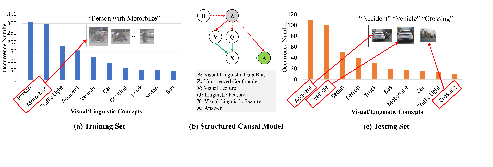
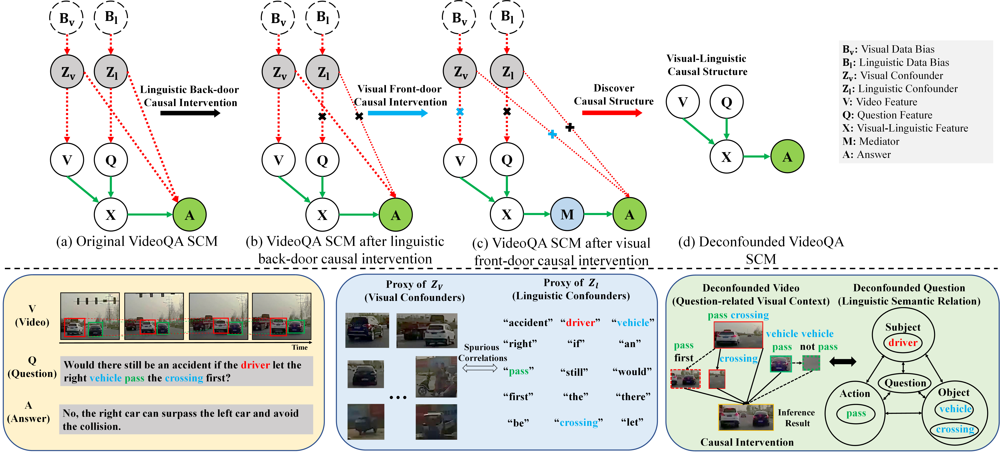

# Qualitative-Analysis
Qualitative-Analysis

##  Why VQA model without causal reasoning tends to learn spurious correlations

Figure 1: The example about why the visual question answering model without causal reasoning tends to learn spurious correlations. (a) A training dataset constructed with visual and linguistic biases that the concepts "person" and "motorbike" are frequently appeared. (b) The structured causal model (SCM) shows how the confounder induces the spurious correlation in event-level visual question answering. The green path denotes the unbiased visual question answering (the true causal effect). The red path is the biased visual question answering caused by the confounders (the back-door path). (c) As a result, if we provide some samples where the "vehicle" concept is highly related to the "accident" to reason how actually the accident happens, the model does not really exploit the true question intention and dominant visual evidence to infer the answer.

## High-level explanation of the causal method

Figure 2: The proposed causal graph of visual-linguistic causal intervention. The green path denotes the unbiased visual question answering (the true causal effect). The red path is the biased visual question answering caused by the confounders (the back-door path). The bottom part of the figure shows the intuitive explanation of the visual-linguistic causal intervention of a real VideoQA sample.

## Qualitative analysis of CMCR in causal relational reasoning

Figure 3: Visualization of four visual-linguistic causal reasoning examples on the correct and failure prediction cases from SUTD-TrafficQA dataset. Each video is accompanied by several question types. The color windows in the videos denotes the concentrated visual concepts for the inference. 
